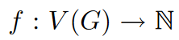
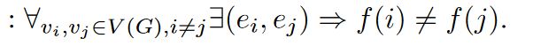
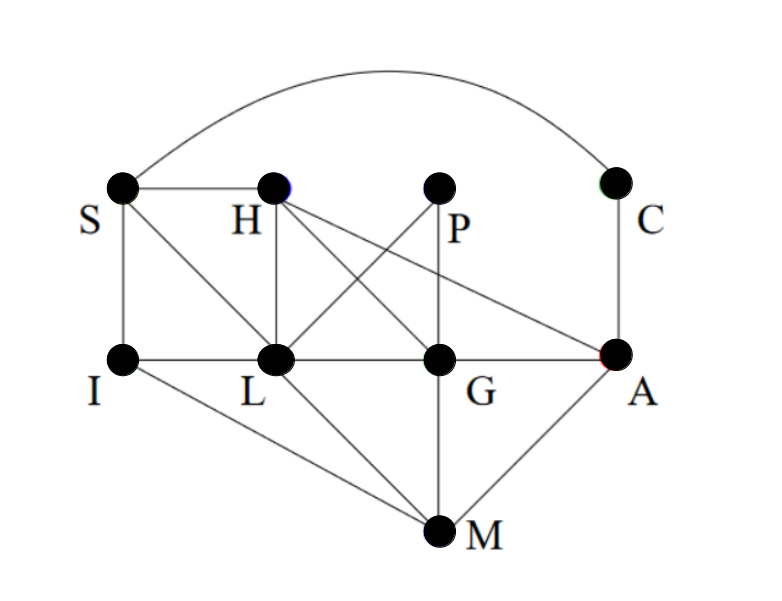
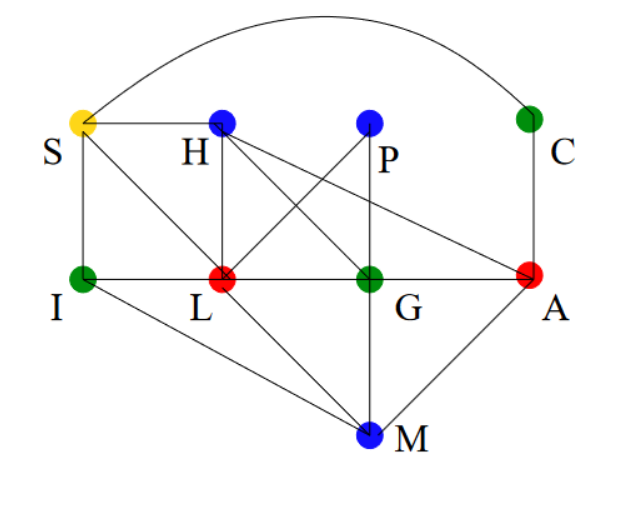

# Graph-Coloring
### Definicion del problema ###

En la teoría de grafos, la coloración de grafos es un caso especial de etiquetado de grafos; es una asignación de etiquetas tradicionalmente llamadas "colores" a los elementos de un grafo sujeta a ciertas restricciones. En su forma más simple, es una forma de colorear los vértices de un grafo de manera que **no haya dos vértices adyacentes del mismo color**; esto se llama colorear vértices.

En términos de teoría de grafos, una coloración adecuada de vértices con k colores es un mapeo.
 
 
 
 tal que
 
 
 
 ### Número cromatico
 
 El número mínimo de colores para el que existe una coloración de vértices adecuada para un grafo G dado se conoce como el **número cromático** del grafo G y se denota por   **_χ(G)._**

Para cual grafo **_G_** no igual **_Kn_** o **_En_** entonces  **_χ(G)>1_**

**El problema de colorear vértices es NP-completo.** 
 
### Aplicaciones ###
1) Elaboración de un horario o tabla de tiempos.
2) Asignación de frecuencias de radio móvil.
3) Sudoku.
4) Asignación de registros.
5) Grafos bipartitos.
6) Colorear mapas.

### Ejemplo ### 
**Grafo de ejemplo**

  

Para este ejemplo tenemos que el numero de grafos es de 

N = 9


### Solucion del grafo de ejemplo.



#### Vector de solución.
**[1, 2, 2, 3, 3, 4, 3, 4, 2]**

1. Amarrilo  
2. Azul 
3. Verde
4. Rojo

En este ejemplo el numero cromatico es

**_χ(G) = 4_**


### Matriz de costo ####


|  |S |H |P |C |I |L |G |A |M |
|--|--|--|--|--|--|--|--|--|--|
|**S** |0 |1 |0 |1 |1 |1 |0 |0 |0 |
|**H** |1 |0 |0 |0 |0 |1 |1 |1 |0 |
|**P** |0 |0 |0 |0 |0 |1 |1 |0 |0 |
|**C** |1 |0 |0 |0 |0 |0 |0 |1 |0 |
|**I** |1 |0 |0 |0 |0 |1 |0 |0 |1 |
|**L** |1 |1 |1 |0 |1 |0 |1 |0 |1 |
|**G** |0 |1 |1 |0 |0 |1 |0 |1 |1 |
|**A** |0 |0 |0 |1 |0 |0 |1 |0 |1 |
|**M** |0 |0 |0 |0 |1 |1 |1 |1 |0 |


## Función de costo
``` python
def Costo(sol):
  ncolores=len(Counter(sol))
  return ncolores
```

## Funcion generar vecino
``` python
def Genera_Vecino(size,graph,color):
  sol = [0 for i in range(size)]
  ncolor=random.uniform(1, size+1)
  for i in range(size):
    r = int(random.uniform(1, ncolor))
    sol[i] = r
  #verfifica que la solucion sea valida  
  if (isSafe(graph, sol,size))==-1:
    sol=Genera_Vecino(size,graph,color)
  return sol
```
##  Instansias a ejecutar 

 1. 10    con al menos tres vertices en promedio
 2. 50    con al menos tres vertices en promedio
 3. 500  con al menos tres vertices en promedio

Los archivos se encuentran disponibles como 10grafos.csv...

A continuacion el codigo para leer el arhivo csv y guardarlo en una matriz.

``` python
import csv
newMatrix = []
with open('nombre.csv', 'r', newline='') as file:
  myreader = csv.reader(file, delimiter=',')
  for rows in myreader:
   newMatrix.append(rows)
newMatrix = np.array(newMatrix)

```


 

